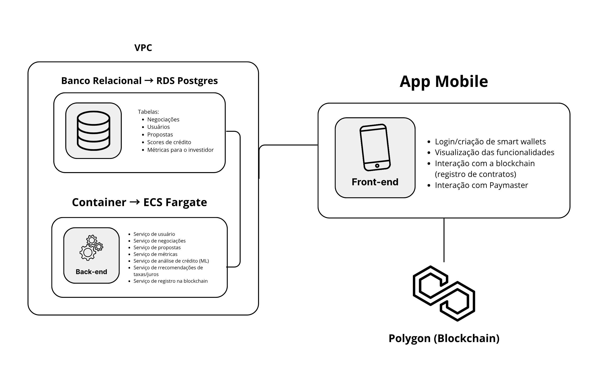
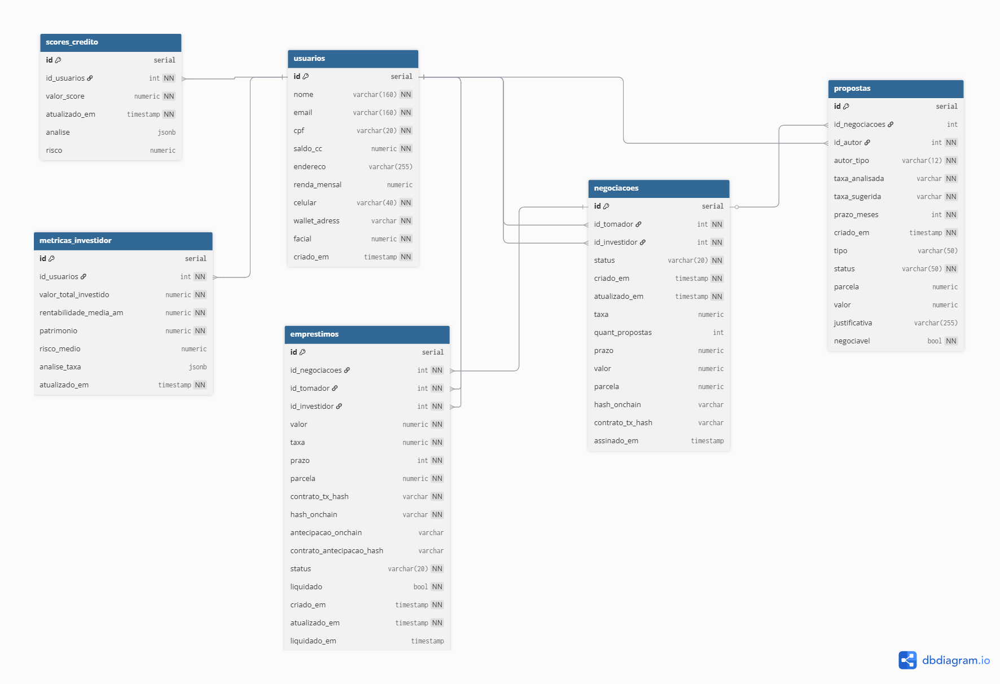
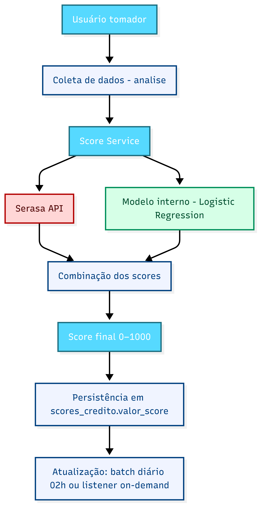
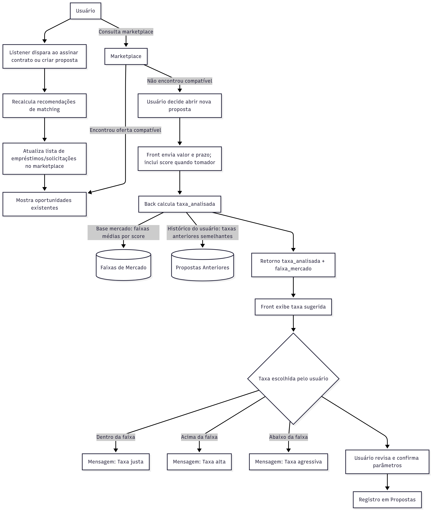

# 📄 Proposta de projeto: negocia.ai
## G35 | João Victor de Souza Campos | Nataly de Souza Cunha | Yasmin Ingrid Silva Minário

## 1. Introdução

<p align="center">
  
</p>

A QI Tech é referência no mercado de infraestrutura para soluções financeiras digitais, com foco em criar tecnologias seguras, escaláveis e inovadoras. Dentro desse ecossistema, o **Inovacamp QI Tech 2025** propõe o desenvolvimento de soluções criativas no setor financeiro, aproximando participantes da realidade prática de produtos digitais e dos desafios regulatórios.

O mercado de **empréstimos peer-to-peer (P2P)** tem ganhado força globalmente ao oferecer crédito de forma direta entre pessoas, sem intermediários tradicionais como bancos. Essa modalidade promete mais agilidade, taxas potencialmente melhores e inclusão financeira de públicos que ficam à margem do sistema bancário. No entanto, ainda enfrenta problemas de confiança, rigidez nas regras e dificuldade de avaliar riscos de crédito com transparência.

É nesse contexto que surge o **negocia.ai**, um aplicativo de crédito P2P que busca resolver as falhas atuais do setor e criar um ambiente mais justo, flexível e confiável para tomadores e investidores.

---

## 2. Problema
O acesso a crédito no modelo P2P tradicional — e em muitos protocolos descentralizados — ainda enfrenta barreiras significativas:

1. **Rigidez dos protocolos atuais (over-collateralized)**  
   A exigência de colaterais maiores que o valor do empréstimo restringe o acesso apenas a quem já tem liquidez, excluindo grande parte dos potenciais usuários.

2. **Ausência de diálogo entre as partes**  
   Plataformas automatizadas fixam taxas e prazos de forma imutável, sem espaço para negociação ou contraproposta. Isso reduz flexibilidade e ignora o perfil individual do tomador ou o apetite de risco do investidor.

3. **Assimetria de informação e fragilidade na análise de crédito**  
   Investidores têm dificuldade em avaliar o risco de emprestar devido à falta de dados ou critérios limitados. Sem métricas confiáveis, a insegurança reduz o incentivo a participar.

4. **Execução frágil de contratos**  
   Sem garantias automáticas de cumprimento das condições acordadas, negociações podem perder credibilidade e se tornar pouco confiáveis.

**Impactos:**
- Exclusão de usuários com baixo acesso a colateral.
- Baixa adesão de investidores por medo de inadimplência.
- Experiência de uso limitada e desconfiança no sistema.
- Perda de eficiência em relação ao potencial do crédito P2P.

---
<br>

<p align="center">
  
</p>

## 3. Solução Proposta
O **negocia.ai** é uma plataforma P2P de crédito que conecta tomadores e investidores em um ambiente seguro, transparente e com espaço para negociação direta. A solução se apoia em três pilares principais:

- **Negociação flexível**: tomadores e investidores podem fazer contrapropostas em taxa e prazo, recriando a dinâmica de negociação do mundo real, mas com garantias digitais.  
- **Análise de crédito transparente**: cada usuário recebe um score de crédito consolidado a partir de fontes externas (ex.: Serasa) e histórico interno da plataforma, reduzindo assimetria de informação e apoiando decisões mais seguras.  
- **Execução confiável**: contratos são formalizados digitalmente, garantindo rastreabilidade, clareza e automação de etapas críticas.  

**Diferenciais em relação a soluções existentes**:
- Espaço real de negociação, e não apenas “take it or leave it”.
- Score híbrido (interno + externo), adaptado ao perfil e histórico do usuário.
- Transparência e rastreabilidade em todas as etapas, fortalecendo a confiança.

**Principais benefícios:**
- **Tomadores**: acesso a crédito justo e flexível, mesmo sem colateral elevado.
- **Investidores**: maior clareza sobre risco, suporte na diversificação e proteção contra inadimplência.
- **Mercado**: inclusão financeira, mais eficiência e fortalecimento do modelo P2P.

---

## 4. Objetivos do Projeto

### Objetivo Geral
Desenvolver uma plataforma de crédito P2P que reduza barreiras de acesso, aumente a confiança entre as partes e ofereça um sistema de negociação transparente, flexível e seguro.

### Objetivos Específicos
- Criar um **sistema de cadastro e validação antifraude** para onboarding confiável.
- Implementar um **motor de score híbrido (interno + externo)** para avaliação de risco.
- Oferecer **funcionalidades de solicitação e oferta de crédito** com espaço para contraproposta.
- Desenvolver dashboards personalizados para **monitorar carteira, risco e histórico**.
- Garantir **execução automática e rastreável** dos contratos.
 

---

## 5. Personas

### 🧑 Persona 1: O Tomador Planejado (Carlos)

**Nome:**	Carlos, 30 anos <br>
**Profissão:**	Profissional de TI <br>
**Score:**	Excelente (790)

### Cenário:
Carlos é um profissional dedicado e financeiramente responsável. Ele sempre pagou suas contas em dia e construiu um ótimo score de crédito ao longo dos anos. Ele quer fazer um curso de especialização em Inteligência Artificial que custa R$10.000, um investimento que pode alavancar seu salário em até 30% em um ano, mas ele não quer descapitalizar sua reserva de emergência.

### Objetivos:

- Conseguir um empréstimo de R$10.000 com o mínimo de burocracia.

- Pagar uma taxa de juros justa, que reflita seu status de excelente pagador.

- Sentir que seu bom comportamento financeiro é reconhecido e recompensado.

### Frustrações (A Jornada que o trouxe até aqui):

- **A Frustração com os Grandes Bancos:** Carlos primeiro foi ao seu banco tradicional. Por ser cliente há anos, achou que teria uma boa oferta. O banco lhe ofereceu um crédito pré-aprovado, mas com uma taxa de juros padrão, alta, a mesma que ofereceriam para alguém com score muito inferior. Ele se sentiu apenas mais um número em uma planilha, e seu bom histórico não valeu nada.

- **A Frustração com as Fintechs Tradicionais:** Em seguida, ele tentou uma fintech de crédito conhecida. O processo foi rápido e digital, mas o algoritmo, apesar de reconhecer seu bom score, só liberou um limite de R$7.500 – insuficiente para seu curso. Não havia canal para explicar seu objetivo ou para solicitar uma reavaliação. A decisão foi final, fria e sem espaço para diálogo.

- **A Dor Principal do Carlos:** Ele percebe uma grande injustiça no mercado. *"De que adianta eu ser um ótimo pagador e ter um score excelente se, no final, sou tratado com as mesmas taxas abusivas ou com limites que não atendem minha necessidade? Eu não quero um favor, quero uma condição justa pelo meu bom perfil."*

### 👩 Persona 2: A Investidora Estratégica (Sofia)
**Nome:**	Sofia, 45 anos <br>
**Profissão:**	Gerente de Projetos <br>
**Perfil de Investidora:**	Moderado

### Cenário:
Sofia tem um bom capital guardado e busca diversificar seus investimentos. Ela já investe em opções de renda fixa (CDB, Tesouro), mas está frustrada com a baixa rentabilidade. Ela também tem ações, mas não gosta da volatilidade e da falta de controle.

### Objetivos:

- Obter uma rentabilidade superior à da renda fixa tradicional.

- Investir em ativos com um risco controlado e previsível.

- Ter transparência e controle sobre onde seu dinheiro está alocado.

### Frustrações (O que a faz buscar alternativas):

- **Renda Fixa:** Retornos muito baixos, mal acompanham a inflação.

- **Bolsa de Valores:** Muita volatilidade e requer um acompanhamento constante que ela não tem tempo para fazer.

- **Outras Plataformas P2P:** Ela já explorou outras plataformas P2P, mas o modelo era uma "caixa-preta". Ela colocava o dinheiro em um "fundo" de risco moderado, mas não sabia exatamente para quem estava emprestando. Ela não tinha poder de escolha ou negociação.

- **A Oportunidade que Sofia Vê:** *"Eu quero investir em pessoas, não apenas em siglas. Se uma plataforma pudesse me apresentar uma carteira de tomadores já pré-selecionados, com os melhores scores do Brasil, e me desse a chance de negociar um retorno justo diretamente com eles, eu teria o melhor dos dois mundos: risco baixo e rentabilidade atrativa."*

---

# Estrutura de Pastas do negocia.ai

```bash
src/
└── backend/
    └── src/
        └── app/
            ├── api/
            │   └── routers.py
            ├── database/
            │   ├── create_database.sql
            │   └── Dockerfile
            ├── models/
            │   ├── negociacao.py
            │   ├── proposta.py
            │   └── usuario.py
            │   └── score.py
            │   └── metricas_investidor.py
            ├── services/
            │   ├── api_score.py
            │   ├── blockchain.py
            │   ├── calculo_taxas_juros.py
            │   ├── dashboard.py
            │   ├── negociacao.py
            │   ├── proposta.py
            │   └── usuario.py
            └── model/
                └── model_analise_credito.py
        ├── config.py
        ├── Dockerfile
        ├── requirements.txt
        └── docker-compose.yml
    frontend/
    └──src/
          ├── assets/
          │   ├── fonts/
          │   └── images/
          ├── components/
          │   ├── atoms/
          │   ├── molecules/
          │   └── organisms/
          ├── contexts/
          │   └── AuthContext.tsx
          ├── hooks/
          │   ├── useAuth.ts
          │   └── useNegotiations.ts
          ├── navigation/
          │   ├── AppNavigator.tsx
          │   └── AuthStack.tsx
          ├── screens/
          │   ├── Auth/
          │   ├── Borrower/
          │   └── Investor/
          ├── services/
          │   └── api.ts
          ├── styles/
          │   ├── colors.ts
          │   ├── spacing.ts
          │   └── typography.ts
          ├── types/
          │   └── index.ts
          └── utils/
              └── formatters.ts
    bash
.env
README.md
```

## 📂 src/backend/src

Código-fonte principal da aplicação backend, organizado por camadas (API, database, models, services, ML).

### 📂 app/api
- **routers.py**  
  Define as rotas da API (endpoints HTTP) do FastAPI.  
  Centraliza a orquestração dos serviços e expõe as funcionalidades para o front-end/mobile.

### 📂 app/database
- **create_database.sql**  
  Script SQL inicial para criação das tabelas e relações do banco de dados (Postgres).  
- **Dockerfile**  
  Dockerfile específico para configurar a imagem do banco local (quando usado com `docker-compose`).

### 📂 app/models
Contém os modelos (entidades) que representam as tabelas do banco e objetos de negócio.  
- **negociacao.py** – Modelo da negociação entre tomador e investidor.  
- **proposta.py** – Modelo das propostas e contrapropostas.  
- **usuario.py** – Modelo dos usuários, incluindo dados cadastrais.  
- **score.py** – Modelo das análises de score de crédito. 
- **metricas_investidor.py** – Modelo das métricas do investidor.

### 📂 app/services
Serviços e regras de negócio que dão suporte às rotas.  
- **api_score.py** – Serviço responsável pela consulta/integração com API de score de crédito (integrada ao Serasa).  
- **blockchain.py** – Serviço para interação com a blockchain Polygon (registro de contratos e leitura de hashes).  
- **calculo_taxas_juros.py** – Funções auxiliares para cálculo de taxas e juros dos empréstimos.  
- **dashboard.py** – Serviço para agregação e cálculo de métricas exibidas nas dashboards dos usuários.  
- **negociacao.py** – Lógica de negócio das negociações (criação, atualização de status).  
- **proposta.py** – Lógica de envio/validação de propostas e contrapropostas.  
- **usuario.py** – Serviço para cadastro, login e gestão de dados de usuários.  

### 📂 model
- **model_analise_credito.py**  
  Implementação de modelo de análise de crédito (através de machine learning).  
  Utilizado para classificação de risco de tomadores de empréstimo.

---

## ⚙️ Arquivos de Configuração

- **config.py**  
  Configurações globais do backend (chaves de API, conexões de banco, parâmetros de blockchain).  

- **Dockerfiles**  
  Dockerfile para empacotar e rodar o backend no ECS Fargate (ou localmente), e outro para a construção da imagem do banco Postgres para testes locais, configurado de maneira análoga à instância RDS (AWS) em produção.  

- **requirements.txt**  
  Lista de dependências Python (FastAPI, Web3.py, scikit-learn, entre demais utilitários do aplicativo).  

- **docker-compose.yml**  
  Orquestração de containers para desenvolvimento local (ex.: Postgres + backend).  

- **.env**  
  Variáveis de ambiente sensíveis (senhas, tokens, chaves de API).  

- **README.md**  
  Documentação inicial do projeto, instruções de setup e guia rápido.  


- Visão geral da arquitetura (monolito, microserviços, serverless, etc.)
- Componentes principais
- Fluxo de dados entre front-end, backend e blockchain
- Integrações externas (ex.: APIs, parceiros)

## 📂 src/frontend/src

Código-fonte principal da aplicação mobile em React Native, organizado por funcionalidade e responsabilidade para garantir escalabilidade e manutenibilidade.

### 📂 assets
Recursos estáticos da aplicação.

- **fonts/** – Arquivos de fontes customizadas (ex: `Inter-Regular.ttf`, `Inter-Bold.ttf`).  
- **images/** – Imagens e ícones estáticos (ex: logo, ícone do trevo do estado vazio).  

### 📂 components
Componentes de UI reutilizáveis, organizados seguindo uma abordagem inspirada no Atomic Design.

- **atoms/** – Os menores componentes possíveis, como `Button.tsx`, `Input.tsx`, `ScoreRing.tsx`. Eles são os blocos de construção da UI.  
- **molecules/** – Combinações de átomos para formar componentes mais complexos, como `SearchBar.tsx` ou `LoanOfferCard.tsx`.  
- **organisms/** – Seções maiores da interface compostas por moléculas e/ou átomos, como `Header.tsx` ou `LoanList.tsx`.  

### 📂 contexts
Gerenciamento de estado global com a Context API do React.  

- **AuthContext.tsx** – Contexto para gerenciar o estado de autenticação do usuário (token, dados do usuário logado).  

### 📂 hooks
Hooks customizados que encapsulam lógicas de negócio e interações com serviços.

- **useAuth.ts** – Hook para interagir com o `AuthContext`, provendo funções como `signIn`, `signOut`, `signUp`.  
- **useNegotiations.ts** – Hook para buscar, criar e atualizar o estado das negociações de um usuário.  

### 📂 navigation
Configuração da navegação do app usando React Navigation.

- **AuthStack.tsx** – Navegador do tipo *Stack* para o fluxo de autenticação (Login, Cadastro, Seleção de Perfil).  
- **AppNavigator.tsx** – Navegador principal que controla a navegação pós-login, incluindo o *Tab Navigator* ou *Drawer*.  

### 📂 screens
Contém as telas completas da aplicação, organizadas por fluxo.  

- **Auth/** – Telas de `LoginScreen.tsx`, `SignUpScreen.tsx`, `ProfileSelectionScreen.tsx`.  
- **Borrower/** – Telas do fluxo do Tomador: `DashboardScreen.tsx`, `OfferDetailsScreen.tsx`, `NegotiationScreen.tsx`, etc.  
- **Investor/** – Telas do fluxo do Investidor: `DashboardScreen.tsx`, `SolicitationDetailsScreen.tsx`, `CounterProposalScreen.tsx`, etc.  

### 📂 services
Camada responsável pela comunicação com APIs externas, principalmente o backend.  

- **api.ts** – Configuração da instância do Axios (ou outra lib HTTP), com URL base e interceptors.  

### 📂 styles (ou theme)
Definição do Design System em código.  

- **colors.ts** – Exporta a paleta de cores (ex: `primaryBlue`, `investorPurple`, `warningYellow`).  
- **spacing.ts** – Exporta tokens de espaçamento (ex: `spacing.md = 16`).  
- **typography.ts** – Exporta estilos de fonte (ex: `H1`, `H2`, `Body`).  

### 📂 types
Definições de tipos e interfaces TypeScript para garantir tipagem.  

- **index.ts** – Exporta tipos como `User`, `LoanOffer`, `Negotiation`.  

### 📂 utils
Funções auxiliares e utilitárias puras.  

- **formatters.ts** – Funções para formatar valores, como `formatCurrency(10000)` → `"R$10.000,00"`.  

## 🛠️ **Requisitos Funcionais**

| ID    | Descrição                                                                                                                                                                                                                                                | Prioridade |
|-------|----------------------------------------------------------------------------------------------------------------------------------------------------------------------------------------------------------------------------------------------------------|------------|
| RF001 | **Cadastro e Onboarding de Usuários**<br>O sistema deve permitir que novos usuários (tomadores e investidores) se cadastrem fornecendo dados pessoais e documentos.                                                                                          | Alta       |
| RF002 | **Validação de Cadastro e Antifraude**<br>O sistema deve integrar-se com as APIs de Risk Solutions da QI Tech para validação de documentos, classificação de perfil e verificação antifraude durante o onboarding do usuário.                                 | Alta       |
| RF003 | **Cálculo/Aquisição de Score de Crédito**<br>O sistema deve calcular um score de crédito interno baseado em modelos de automação com inteligência artificial próprios e, em caso de dados insuficientes de usuários novos, consultar a API do Serasa.         | Alta       |
| RF004 | **Gerenciamento de Perfil de Risco**<br>O sistema deve manter um perfil de risco atualizado para cada usuário, baseado no score, histórico de empréstimos, dados de smart contracts e Open Finance (mockado inicialmente).                                   | Média      |
| RF005 | **Solicitação de Empréstimo**<br>O tomador deve poder solicitar um empréstimo informando o valor desejado, prazo e finalidade.                                                                                                                               | Alta       |
| RF006 | **Dashboard de Propostas de Empréstimo (Investidor)**<br>O sistema deve exibir para o investidor uma lista de empréstimos solicitados, com as taxas e juros sugeridos pelo tomador, juntamente com recomendações baseadas no perfil de risco do tomador.      | Alta       |
| RF007 | **Negociação de Taxas e Juros**<br>O investidor deve poder fazer uma proposta de taxa e juros diferente da sugerida pelo tomador. O tomador deve poder aceitar, recusar ou fazer uma contraproposta.                                                         | Alta       |
| RF008 | **Histórico de Negociações**<br>O sistema deve armazenar o histórico completo de todas as propostas e contrapropostas realizadas para cada solicitação de empréstimo.                                                                                        | Média      |
| RF009 | **Histórico de Empréstimos**<br>O sistema deve manter um histórico completo de todos os empréstimos de um usuário, incluindo valor, taxas acordadas, tempo de vigência, status e dados do smart contract.                                                    | Alta       |
| RF010 | **Dashboard de Performance (Investidor)**<br>O sistema deve fornecer ao investidor um dashboard com métricas de performance de sua carteira (ex: retorno total, taxa de inadimplência, diversificação).                                                     | Alta       |
| RF011 | **Recomendações de Diversificação**<br>O sistema deve recomendar ao investidor oportunidades de diversificação de sua carteira, tanto em tipos de empréstimo quanto em perfis de tomadores.                                                                  | Baixa      |
| RF012 | **Integração com Open Finance (Futuro)**<br>O sistema deve ser preparado para uma futura integração com o Open Finance para enriquecer a análise de perfil com dados transacionais reais.                                                                    | Baixa      |
| RF013 | **Navegação entre Funcionalidades**<br>O sistema deve permitir que o usuário navegue entre funcionalidades como investidor ou tomador de empréstimos.                                                                                                        | Alta       |
| RF014 | **Cálculo de Margens de Taxas/Juros por Risco**<br>O sistema deve ser capaz de realizar cálculos de margens das taxas/juros por risco comumente aceitas nas negociações da plataforma, auxiliando tomadores e investidores no sucesso das negociações.        | Alta       |

---

## ✨ **Requisitos Não Funcionais**

| ID     | Categoria    | Descrição                                                                                                                                                                                                                                         |
|--------|--------------|---------------------------------------------------------------------------------------------------------------------------------------------------------------------------------------------------------------------------------------------------|
| RNF001 | Segurança    | O sistema deve seguir as melhores práticas de segurança (OWASP), com todos os dados sensíveis criptografados em trânsito e em repouso.                                                                                                            |
| RNF002 | Desempenho   | As páginas principais (login, dashboard) devem carregar em menos de 5 segundos em uma conexão de 3G. Para dados de menor volatilidade, as APIs devem responder em até 2 segundos para 95% das requisições, utilizando armazenamento local para otimização das entregas. |
| RNF004 | Usabilidade  | A interface deve ser intuitiva, seguindo princípios de UX/UI, e responsiva, funcionando adequadamente em dispositivos desktop e móveis.                                                                                                            |
| RNF005 | Confiabilidade | As transações financeiras e a execução dos smart contracts devem ser atômicas (não podem falhar parcialmente) e garantir a consistência dos dados.                                                                                              |
| RNF006 | Escalabilidade | A arquitetura do sistema deve incluir sistema de filas para ser capaz de organizar as requisições e escalar horizontalmente, suportando um aumento de 10x no número de usuários sem degradação crítica do desempenho.                           |
| RNF007 | Integração   | As integrações com APIs externas devem ser resilientes, com mecanismos de retry e fallback para lidar com indisponibilidades temporárias.                                                                                                         |
| RNF008 | Conformidade | O sistema deve estar em conformidade com a LGPD (Lei Geral de Proteção de Dados), garantindo o tratamento adequado dos dados pessoais dos usuários.                                                         |

### Requisitos como User Stories

Esta subseção apresenta os requisitos do projeto sob a forma de User Stories, facilitando o entendimento das necessidades reais do público alvo da nossa solução.

### User Stories — Requisitos Funcionais

#### 1. Cadastro e onboarding de usuários

- **Como usuário**, quero me cadastrar informando meus dados pessoais e documentos para que eu possa acessar a plataforma.
- **Como administrador**, quero que o sistema valide os dados do cadastro para evitar usuários falsos.

---

#### 2. Validação de cadastro e antifraude

- **Como usuário**, quero que meus documentos sejam verificados automaticamente para que eu tenha mais segurança no processo de cadastro.
- **Como administrador**, quero que o sistema integre com a QI Tech Risk Solutions para garantir que perfis fraudulentos sejam bloqueados.

---

#### 3. Cálculo e aquisição de score de crédito

- **Como investidor**, quero consultar o score de crédito de um tomador para decidir se vou investir nele.
- **Como tomador**, quero que o sistema busque meu score do Serasa quando não houver histórico interno, para que eu possa solicitar crédito.

---

#### 4. Gerenciamento de perfil de risco

- **Como investidor**, quero acessar um perfil de risco consolidado de cada tomador para entender o risco antes de emprestar.
- **Como administrador**, quero que o sistema atualize perfis de risco dinamicamente a partir de score, histórico de empréstimos e dados do Open Finance (quando disponível).

---

#### 5. Solicitação de empréstimo

- **Como tomador**, quero solicitar um empréstimo informando valor, prazo, taxas e juros para obter recursos de forma rápida.

---

#### 6. Dashboard de propostas de empréstimo (investidor)

- **Como investidor**, quero visualizar todos os pedidos de empréstimos ativos com informações de score e taxas sugeridas para escolher onde investir.
- **Como investidor**, quero receber recomendações de empréstimos alinhados ao meu perfil de risco.

---

#### 7. Negociação de taxas e juros

- **Como investidor**, quero fazer uma proposta de taxa diferente da sugerida para tentar obter melhores condições.
- **Como tomador**, quero visualizar as contrapropostas de investidores e decidir se aceito, recuso ou faço outra contraproposta.

---

#### 8. Histórico de negociações

- **Como usuário (investidor ou tomador)**, quero acessar o histórico de todas as propostas e contrapropostas de um empréstimo para acompanhar a negociação.

---

#### 9. Histórico de empréstimos

- **Como usuário**, quero acessar meu histórico de empréstimos com informações sobre valores, prazos, taxas e status.

---

#### 10. Dashboard de performance (investidor)

- **Como investidor**, quero visualizar métricas de performance da minha carteira (retorno total, taxa de inadimplência, diversificação) para acompanhar meus resultados.

---

#### 11. Recomendações de diversificação

- **Como investidor**, quero receber sugestões de diversificação de carteira para reduzir riscos e equilibrar meu portfólio.

---

#### 12. Integração com Open Finance (futuro)

- **Como administrador**, quero que o sistema esteja preparado para integrar dados do Open Finance no futuro para enriquecer os perfis de risco.

---

#### 13. Navegação entre funcionalidades

- **Como usuário**, quero poder alternar entre a aba de tomador e a aba de investidor para usar a plataforma tanto para pegar quanto para emprestar dinheiro.
- **Como sistema**, quero que o dashboard permita alternar entre as visões de “investidor” e “tomador” de forma fluida, garantindo consistência nos dados apresentados.

---

#### 14. Cálculo de sugestões de taxas/juros

- **Como usuário tomador ou investidor**, quero poder visualizar recomendações de taxas/juros mais aceitos dentre os usuários da plataforma, para aumentar as minhas chances de sucesso de ofertas e contrapropostas.
- **Como sistema**, nas visualizações de oferta, proposta ou contraproposta, quero que seja mostrado ao usuário frases de recomendações de taxas e juros, garantindo mecanismos de melhoria de negociações.

---

### User Stories — Requisitos Não Funcionais

#### Segurança

- **Como usuário**, quero que meus dados sejam criptografados em trânsito e em repouso para garantir privacidade.
- **Como administrador**, quero que o sistema siga práticas OWASP para mitigar ataques.

---

#### Desempenho

- **Como usuário**, quero que o login e o dashboard carreguem em até 5 segundos mesmo em redes lentas para não perder tempo.
- **Como usuário**, quero que as respostas da API sejam rápidas para ter fluidez na navegação.

---

#### Usabilidade

- **Como usuário**, quero que a interface seja intuitiva e responsiva para usar facilmente no celular e no computador.

---

#### Confiabilidade

- **Como usuário**, quero que as transações financeiras sejam atômicas e consistentes para não perder dinheiro em caso de falhas.

---

#### Escalabilidade

- **Como administrador**, quero que o sistema consiga suportar 10x mais usuários sem degradação de performance para acompanhar o crescimento.

---

#### Integração

- **Como sistema**, quero ter mecanismos de retry e fallback em APIs externas para não prejudicar o usuário em caso de indisponibilidade.

---

#### Conformidade

- **Como usuário**, quero que o sistema esteja em conformidade com a LGPD para que meus dados pessoais sejam tratados corretamente.


---

## 🏛️ Modelagem de dados e arquitetura

### Diagrama de Componentes

<div align="center">
<sub>Figura X - Diagrama de componentes + Cloud</sub><br>
<br>

<br>
<br>
<sup>Fonte: Material produzido pelos autores (2025)</sup>
</div>
<br>

A arquitetura do aplicativo mobile negocia.ai foi desenhada para modularizar as principais partes da solução em componentes independentes, facilitando manutenção, escalabilidade e integração contínua. Os três componentes centrais são: banco de dados relacional, backend de serviços e frontend mobile.

### Banco de Dados

<div align="center">
<sub>Figura X - Modelagem lógica do banco de dados</sub><br>
<br>

<br>
<br>
<sup>Fonte: Material produzido pelos autores (2025)</sup>
</div>
<br>

O banco de dados relacional utiliza PostgreSQL, encapsulado em uma imagem Docker para padronização do ambiente de desenvolvimento e produção. Ele armazena informações em cinco tabelas principais:

- **usuários**: dados cadastrais, validação e perfil.
- **negociações**: registros de negociações entre tomadores e investidores.
- **propostas**: termos de empréstimo, taxas, prazos, status e justificativas.
- **scores de crédito**: resultados da análise de crédito, integrando machine learning e API Serasa.
- **métricas do investidor**: dados de performance dos investimentos ofertados.

Os relacionamentos seguem as seguintes cardinalidades:

- Um usuário possui um score de crédito (1:1).
- Um usuário pode participar de várias negociações; cada negociação envolve dois usuários (N:N), intermediada pela tabela de propostas.
- Um usuário possui um registro único de métricas de investidor (1:1).

O banco é executado localmente via Docker e, em produção, é provisionado em uma instância RDS (AWS), garantindo escalabilidade, segurança e alta disponibilidade.

### Backend

O backend é desenvolvido em Python, utilizando frameworks como FastAPI para APIs REST e integração com serviços externos (ex.: Serasa, Blockchain). Ele é containerizado e executado em AWS ECS Fargate, eliminando a necessidade de gerenciamento manual de servidores.

Principais serviços implementados:

- Gerenciamento de usuários (criação, validação, autenticação).
- Fluxos de negociações e propostas de empréstimo.
- Visualização de métricas de performance para investidores.
- Cálculo de score de crédito, integrando machine learning e API Serasa.
- Filtragem de ofertas e condições de empréstimo por perfil de risco.
- Registro de contratos de empréstimo na Blockchain Polygon.

A orquestração dos serviços é feita via containers, com deploy automatizado e escalável.

### Frontend

O frontend é desenvolvido em React Native, garantindo experiência nativa em dispositivos móveis (Android/iOS) e integração direta com as APIs do backend. A escolha do React Native se dá pela alta produtividade, comunidade ativa e facilidade de manutenção multiplataforma. Por ser um aplicativo mobile nativo, o deploy é realizado diretamente nas lojas de aplicativos, dispensando infraestrutura cloud dedicada para o frontend.

---

## 🧠 Motores de Decisão

### **1. Motor de Score**

#### 1) Objetivo

Calcular um **score final (0–1000)** que representa o risco de crédito do usuário como tomador combinando:

1.  **Fonte externa: Serasa** (para usuários sem histórico ou com histórico curto na plataforma -> "**cold start**" e "**thin file**").
2.  **Fonte interna:** baseada em **modelo supervisionado**, que utiliza os dados do histórico operacional do usuário na plataforma para estimar diretamente a **probabilidade de *default***. Essa probabilidade é então convertida em um score contínuo de 0 a 1000, refinando a avaliação de risco de cada tomador.

**Persistimos apenas:**

* `scores_credito.analise` (**JSON** com métricas agregadas).
* `scores_credito.valor_score` (resultado final **0–1000**).

O recálculo ocorre **1x ao dia (batch)** e também **sob demanda via listener** após atualizar `analise`.

#### 2) Escopo e Premissas

* O score **não considera ações como investidor** (emprestador); só como **tomador**.
* A análise interna adota diretamente um **modelo supervisionado**, que utiliza rótulos de inadimplência e quitação para treinar a previsão de risco. O modelo estima a **probabilidade de *default*** de cada tomador com base em seu histórico operacional e dados da plataforma, convertendo esse resultado em um score contínuo de **0 a 1000**. Dessa forma, a solução já nasce alinhada às práticas do mercado de crédito e evolui em precisão conforme mais dados históricos são acumulados.

### **Fluxo Geral:**

<p align="center">
  
</p>


#### 3) Fontes de Dados

##### 3.1 Off-chain (Banco existente)

Tabelas principais já existentes (não alterar):

* `usuarios`
* `negociacoes`
* `propostas`
* `scores_credito` (usaremos apenas `analise` e `valor_score` + `atualizado_em`)
* `metricas_investidor` (apenas se algum campo ajudar na extração; não entra no score final por ser ótica do investidor)

##### 3.2 Externa

* **API Serasa** (score externo para *cold start* e composição do score final).

#### 4) Especificação do `analise`

O `analise` consolida somente métricas de tomador:

```json
{
  "tempo_na_plataforma_meses": 0,
  "emprestimos_contratados": 0,
  "emprestimos_quitados": 0,
  "emprestimos_inadimplentes": 0,
  "taxa_inadimplencia": 0.0,
  "media_taxa_juros_paga": 0.0,
  "media_prazo_contratado": 0,
  "renda_mensal": 0.0,
  "endividamento_estimado": 0.0,
  "propostas_realizadas": 0,
  "propostas_aceitas": 0,
  "media_tempo_negociacao_dias": 0.0
}
```

#### 5) Coleta dos Dados (exemplos de SELECTs)

**Importante:** todos os filtros abaixo consideram o usuário como tomador (ex: `negociacoes.id_tomador = :user_id`).

* **tempo_na_plataforma_meses**

    ```sql
    SELECT EXTRACT(EPOCH FROM (NOW() - u.criado_em)) / 2629800.0 AS meses
    FROM usuarios u
    WHERE u.id = :user_id;
    ```

* **emprestimos_contratados** (negociação “fechada” = `assinado_em IS NOT NULL`)

    ```sql
    SELECT COUNT(*) FROM negociacoes n
    WHERE n.id_tomador = :user_id
      AND n.assinado_em IS NOT NULL;
    ```

* **emprestimos_quitados**

    ```sql
    SELECT COUNT(*) FROM negociacoes n
    WHERE n.id_tomador = :user_id AND n.status = 'quitado';
    ```

* **emprestimos_inadimplentes**

    ```sql
    SELECT COUNT(*) FROM negociacoes n
    WHERE n.id_tomador = :user_id AND n.status = 'inadimplente';
    ```

* **taxa_inadimplencia**

    ```sql
    WITH base AS (
      SELECT COUNT(*)::float AS total
      FROM negociacoes n
      WHERE n.id_tomador = :user_id AND n.assinado_em IS NOT NULL
    ), inad AS (
      SELECT COUNT(*)::float AS qte
      FROM negociacoes n
      WHERE n.id_tomador = :user_id AND n.status = 'inadimplente'
    )
    SELECT CASE WHEN base.total = 0 THEN 0 ELSE (inad.qte / base.total) END AS taxa
    FROM base, inad;
    ```

* **media_taxa_juros_paga / media_prazo_contratado** (assumindo proposta “aceita” referencia os termos finais)

    ```sql
    SELECT AVG(p.taxa_juros_am) AS media_taxa,
          AVG(p.prazo_meses)   AS media_prazo
    FROM propostas p
    JOIN negociacoes n ON n.id = p.id_negociacoes
    WHERE n.id_tomador = :user_id
      AND n.assinado_em IS NOT NULL
      AND p.status = 'aceita';
    ```

* **renda_mensal**

    ```sql
    SELECT COALESCE(u.renda_mensal, 0) FROM usuarios u WHERE u.id = :user_id;
    ```

* **endividamento_estimado** (aprox.: soma valores aceitos e ainda vigentes $\div$ renda)

    ```sql
    WITH renda AS (
      SELECT COALESCE(u.renda_mensal, 0) AS renda FROM usuarios u WHERE u.id = :user_id
    ),
    divida AS (
      SELECT COALESCE(SUM(p.valor), 0) AS aberto
      FROM propostas p
      JOIN negociacoes n ON n.id = p.id_negociacoes
      WHERE n.id_tomador = :user_id
        AND n.status IN ('em andamento')
        AND p.status = 'aceita'
    )
    SELECT CASE WHEN renda.renda = 0 THEN 0 ELSE (divida.aberto / renda.renda) END AS endividamento
    FROM renda, divida;
    ```

* **propostas_realizadas / propostas_aceitas** (como tomador)

    ```sql
    SELECT
      SUM(CASE WHEN p.autor_tipo = 'tomador' THEN 1 ELSE 0 END) AS propostas_realizadas,
      SUM(CASE WHEN p.autor_tipo = 'tomador' AND p.status = 'aceita' THEN 1 ELSE 0 END) AS propostas_aceitas
    FROM propostas p
    JOIN negociacoes n ON n.id = p.id_negociacoes
    WHERE n.id_tomador = :user_id;
    ```

* **media_tempo_negociacao_dias** (da 1ª proposta do tomador até `assinado_em`)

    ```sql
    WITH first_prop AS (
      SELECT MIN(p.criado_em) AS primeira_data
      FROM propostas p
      JOIN negociacoes n ON n.id = p.id_negociacoes
      WHERE n.id_tomador = :user_id
        AND p.autor_tipo = 'tomador'
    ),
    assinada AS (
      SELECT AVG(EXTRACT(EPOCH FROM (n.assinado_em - fp.primeira_data)) / 86400.0) AS media_dias
      FROM negociacoes n CROSS JOIN first_prop fp
      WHERE n.id_tomador = :user_id
        AND n.assinado_em IS NOT NULL
        AND fp.primeira_data IS NOT NULL
    )
    SELECT COALESCE(media_dias, 0.0) FROM assinada;
    ```

Esses `SELECTs` são executados pelo **Score Service** para montar o `analise`.

#### 6) Modelo Interno (Supervisionado)

##### 6.1 Abordagem para Score Interno

* **Por quê?** A solução de análise de crédito precisa gerar um score contínuo (0–1000) que reflita a probabilidade real de inadimplência do tomador. Por isso, adotamos diretamente uma estratégia **supervisionada**, alinhada às práticas consolidadas no mercado financeiro.
* **Abordagem Supervisionada:** Utilizamos dados do histórico operacional do usuário na plataforma (`analise`), combinados com o status das negociações (**quitado vs. inadimplente**).
* O modelo adotado é a **Logistic Regression**, por ser simples, explicável e amplamente usada no mercado de crédito. Esse será o algoritmo de referência para geração do score. Caso o volume e a complexidade dos dados aumentem significativamente, existe a possibilidade de migrar para modelos mais avançados, como XGBoost ou LightGBM, mas apenas como evolução futura.
* Essa probabilidade de default (**PD**) é então convertida em um score padronizado:
  ```
  score = round(1000 * (1 - prob_default))
  ```
* **Vantagens:** **Precisão**, **Escalabilidade** e **Alinhamento com mercado**.
* **Integração simples:** a saída é um único valor contínuo (0–1000), armazenado em `valor_score`, enquanto os insumos ficam no campo `analise`.
* **Tecnologias:**
    * `scikit-learn` $\rightarrow$ **Logistic Regression**, baseline supervisionado.
    * `FastAPI` $\rightarrow$ expor o endpoint `/score`.
    * `SQLAlchemy` $\rightarrow$ coleta de dados.
    * **Batch diário** $\rightarrow$ recalcula `analise` (features) e `valor_score` (score final).

##### 6.2 Pipeline do Modelo Interno

| Fase | Detalhes |
| :--- | :--- |
| **Extração** | Coletar o `analise` de todos os usuários. Buscar rótulos de cada negociação associada (`default` = 1 se inadimplente, 0 caso quitado/em dia). |
| **Preparação** | Conversão de tipos. **Imputação simples** (preencher valores ausentes com a mediana). **Normalização** (`StandardScaler`). Divisão treino/teste: 80% treino, 20% teste, com estratificação. |
| **Treino** (semanal ou mensal) | Algoritmo oficial: **Logistic Regression**. O modelo aprende a prever a probabilidade de default (PD). Persistência: salvar `scaler` + `modelo` em `.joblib`. Métricas de avaliação: AUC-ROC, KS Statistic. |
| **Inferência diária** | Para cada usuário ativo, coletar `analise` atualizado. Aplicar `scaler` + `modelo` treinado. Obter PD $\in [0,1]$. Converter em score interno 0–1000: $$\text{score}=\text{round}(1000\times(1-\text{PD}))$$ |

* **Exemplo:** Usuário com PD = 0.25 $\rightarrow$ Score = 750.
* **Observações:** O pipeline é determinístico e auditável. O cálculo diário garante que mudanças no comportamento do tomador sejam refletidas rapidamente.


#### 7) Fórmula do Score Final

**Média simples** (configurável por ENV; padrão 50/50):

```
final_score = round(0.5 * serasa_score + 0.5 * interno_score)
```

**Fallbacks:**

* Se Serasa indisponível $\rightarrow$ `final = interno_score`
* Se modelo interno indisponível $\rightarrow$ `final = serasa_score`

Não persistimos os intermediários; apenas `analise` e `valor_score` final.


#### 8) Orquestração (Batch diário + Listener)

##### 8.1 Batch Diário (02:00 America/Sao_Paulo)

1.  Para cada usuário tomador ativo: Rodar `SELECTs` $\rightarrow$ montar `analise`.
2.  Atualizar `scores_credito.analise` (`UPDATE`).
3.  **Publicar evento** `score.analise.updated:{user_id}` (Redis Pub/Sub).

  **Score Worker (listener) consome evento:**
  
  * Busca `analise`.
  * Chama Serasa API (com **cache de 24h**).
  * Roda modelo interno (Logistic Regression).
  * Calcula `final_score` (0–1000).
  * Atualiza `scores_credito.valor_score` e `atualizado_em`.

##### 8.2 Listener (on demand)

Toda vez que a aplicação fizer `UPDATE` em `scores_credito.analise`, publica o mesmo evento `score.analise.updated:{user_id}`. O fluxo do *worker* é idêntico ao *batch*.

#### 9) Serviço de Análise — FastAPI

##### 9.1 Endpoints (privados, behind-auth)

* `POST /internal/analysis/recalculate/{user_id}`: Executa `SELECTs`, monta e salva `analise`, publica evento.
* `POST /internal/scores/recalculate/{user_id}`: Força recálculo completo (busca Serasa, roda modelo, salva `valor_score`).
* `POST /internal/scores/recalculate-batch`: Dispara batch diário (com paginação).
* `GET /internal/scores/{user_id}`: Retorna `{ valor_score, atualizado_em }` (leitura do banco).
* `POST /internal/models/retrain`: Re-treina Logistic Regression (uso semanal/mensal).

##### 9.2 Stack e Operação

* **Stack:** FastAPI + Uvicorn, SQLAlchemy, Requests/HTTPX para Serasa, Redis (Pub/Sub).
* **Monitoramento:** Prometheus (`/metrics`) com duração de inferência e QPS.


#### 10) Integração Serasa

##### 10.1 Motivo de uso

* Atribuir score para usuários novos sem histórico (**“cold start”**).
* Servir de componente externo complementar.

##### 10.2 Implementação

* Connector com **cache por 24h** (Redis) para reduzir custos e latência.
* Circuit breaker + retry exponencial.

##### 10.3 Segurança & LGPD

* **Não persistir payload bruto** do Serasa.
* Armazenar apenas: `timestamp` de consulta e valor para composição (usado em memória).


#### 11) Versionamento de Modelo e Reprodutibilidade

* `model_version`: string (ex.: `iforest-2025-09-27`).
* **Artefatos:** `scaler.joblib`, `model.joblib`.
* **Logs de inferência** incluem: `user_id`, `model_version`, `score_interno`, `serasa_used`, `final_score`, `latency_ms`.


#### 12) Observabilidade e Qualidade

* **Métricas:** porcentagem de usuários com `final_score < 300`, mediana do score.
* **Saúde:** taxas de erro Serasa, *cache hit ratio*.
* **Drift check:** monitorar variação de distribuição dos *features* (KS-test simples em batch semanal).

#### 13) Resiliência & Fallback

* Serasa indisponível $\rightarrow$ segue com interno.
* Modelo indisponível $\rightarrow$ segue com Serasa.
* Ambos indisponíveis $\rightarrow$ mantém último `valor_score` e loga incidente.

#### 14) Segurança

* Secrets via Vault/Secrets Manager.
* Conexões TLS, IP allowlist para Serasa.
* **Princípio do mínimo privilégio** (somente SELECT/UPDATE nas colunas necessárias).


#### 15) Roadmap de Evolução (Modelo)

1.  **Fase 1:** Logistic Regression.
2.  **Fase 2:** Enriquecer features (sazonalidade, granularidade por parcela).
3.  **Fase 3:** Ensemble supervisionado (Logistic Regression + modelos de árvore, como XGBoost/LightGBM).

---

### 🚀 **2. Motor de Recomendação**

#### 1) Objetivo
Construir um mecanismo de recomendação que:
- **Para investidores**: sugira empréstimos que mantenham uma carteira diversificada (evitar concentração em apenas um perfil de risco).
- **Para tomadores**: sugira parâmetros de taxa justos e alinhados tanto ao mercado quanto ao histórico do próprio usuário.

A lógica não depende de Machine Learning neste estágio, mas de cálculos estatísticos, filtros e regras de negócio. Isso garante simplicidade, interpretabilidade e performance, além de atender diretamente às necessidades da solução.

#### 2) Escopo e Premissas
- **Investidores**:
  - Recebem recomendações de novos empréstimos no marketplace, baseadas em ranges de valor, taxa e prazo semelhantes aos já investidos, priorizando a diversificação da carteira.
  - Também recebem sugestões de taxa de juros (`taxa_analisada`) quando desejam abrir uma nova proposta de investimento, combinando parâmetros de mercado com seu histórico pessoal.
- **Tomadores**:
  - Recebem sugestão de taxa de juros (`taxa_analisada`) ao criar uma nova proposta de empréstimo, ajustada pela média de mercado e pelo histórico de propostas anteriores.
  - Também recebem recomendações de solicitações de empréstimos semelhantes às que já fizeram, organizadas por parâmetros como prazo, valor e taxa.
- A recomendação não substitui a decisão, apenas apoia com transparência e mensagens claras no front.
- **Orquestração**:
  - **Sugestão de taxa (`taxa_analisada`)**:
    - **Investidores e Tomadores**: a sugestão é calculada on-demand no front, no momento em que o usuário informa valor + prazo de uma nova proposta.
    - O cálculo da taxa combina dados de mercado (faixa média por score) + histórico pessoal.
    - A `taxa_analisada` é exibida em tela, podendo ser opcionalmente registrada em `analise_taxa` apenas para fins de auditoria/analytics.
  - **Recomendações de empréstimos (matching)**:
    - **Investidores**: listener recalcula recomendações sempre que um contrato novo é assinado ou quando novas solicitações entram no marketplace.
    - **Tomadores**: listener recalcula recomendações de solicitações semelhantes sempre que o próprio usuário cria/edita uma proposta ou quando há novas oportunidades no mercado.

### **Fluxo Geral**




#### 3) Fontes de Dados
##### 3.1 Off-chain (Banco existente)
- `usuarios` → perfil do investidor/tomador.
- `negociacoes` → histórico de contratos fechados.
- `propostas` → taxas, prazos e condições aceitas.
- `scores_credito` → score final do tomador.
- `metricas_investidor` → consolidação da carteira (diversificação, histórico).

##### 3.2 Derivados Internos (calculados a partir do banco)
- **Faixas de mercado**: valores agregados que representam a média/mediana das taxas praticadas por faixa de score.
- **Exemplo**:
  - Score 800–1000 → 10–13% a.m.
  - Score 500–799 → 14–18% a.m.
  - Score <500 → acima de 20% a.m.
- Esses dados não vêm de um sistema externo, mas são recalculados internamente em batch diário e usados como insumo para sugerir a `taxa_analisada`.

#### 4) Lógica de Recomendação
##### 4.1 Recomendação de Empréstimos/Solicitações
- **Objetivo**: sugerir oportunidades relevantes (para investir ou para solicitar) que se encaixam melhor no perfil do usuário.
- **Passos**:
  1. Coletar histórico do usuário (investimentos ou solicitações anteriores):
     - Valor médio.
     - Faixa de taxa mais recorrente.
     - Prazo médio.
     - Score dos tomadores com quem já se relacionou.
  2. Montar um array de solicitações/empréstimos ativos no marketplace que batem com esse padrão.
  3. Ordenar esse array pelo grau de compatibilidade com o perfil.
- **Exibição no front**:
  - **Tela inicial** → mostrar apenas o primeiro item da lista (recomendação principal).
  - **Botão “Ver todos”** → exibir todas as oportunidades disponíveis, mas com as mais compatíveis no topo.

##### 4.2 Recomendação de Taxa (`taxa_analisada`)
- **Objetivo**: apoiar o usuário ao definir a taxa de uma nova proposta, equilibrando o histórico pessoal com a média de mercado.
- **Passos**:
  1. **Usuário decide abrir nova oferta/solicitação**:
     - Depois de tentar encontrar opções existentes no marketplace, o usuário escolhe abrir uma proposta nova.
  2. **Sistema sugere `taxa_analisada`**:
     - O sistema calcula a taxa sugerida com base em:
       - Média de mercado (faixa de taxa por categoria de score).
       - Histórico do usuário (taxas praticadas em propostas semelhantes calculadas em tempo real a partir dos parâmetros digitados na tela de “Encontrar ofertas/solicitações”, quando o usuário digita os dados de seu empréstimo ideal).
     - Essa taxa é exibida junto de mensagens de contexto (ex.: justa, alta, agressiva).
  3. **Usuário revisa e confirma**:
     - O usuário pode aceitar a taxa sugerida ou definir outra.
     - Nesse momento ele também revisa os demais parâmetros (valor, prazo, perfil de risco aceito).
- **Exibição no front**:
  - Mostrar a taxa sugerida.
  - Mostrar mensagens de contexto, como:
    - “Você definiu uma taxa justa e alinhada à média de mercado para este perfil de risco. Ótimo!”
    - “Esta taxa de juros é muito alta para o mercado. Sua oferta pode ficar muito tempo sem interessados.”
- **Proposta é criada no banco**:
  - Só após a confirmação, a oferta/solicitação é registrada em `propostas`.
  - A `taxa_analisada` pode ser salva para auditoria.

#### 5) Fluxo Técnico (Front ↔ Back)
- **Criação de proposta (investidor ou tomador)**:
  1. **Usuário decide abrir uma nova oferta/solicitação**:
     - Após consultar o marketplace e não encontrar algo compatível, o usuário opta por criar sua própria proposta.
     - Neste momento, ele já informou valor e prazo no front.
  2. **Front solicita recomendação de taxa**:
     - O front envia os parâmetros temporários (valor + prazo + score do tomador, se aplicável) para o serviço de recomendação.
     - O dado ainda não foi persistido no banco, é apenas input de tela.
  3. **Back calcula `taxa_analisada`**:
     - Com base em:
       - Faixa de mercado (média de taxas por score, derivada internamente a partir do histórico da plataforma).
       - Histórico do usuário (taxas médias de propostas anteriores semelhantes, filtradas por valor e prazo próximos aos informados).
     - O back retorna:
       - `taxa_analisada` (valor sugerido).
       - `faixa_mercado` (ex.: `[11%, 14%]`) para comparação.
  4. **Front exibe recomendação**:
     - Mostra a taxa sugerida (`taxa_analisada`).
     - Mostra mensagens de contexto de acordo com a posição da taxa escolhida pelo usuário em relação à `faixa_mercado`:
       - Dentro da faixa → “Taxa justa e alinhada à média de mercado.”
       - Acima da faixa → “Taxa alta, pode demorar a atrair interessados.”
       - Abaixo da faixa → “Taxa agressiva, pode atrair investidores rapidamente, mas avalie se é sustentável.”
  5. **Usuário revisa e confirma**:
     - Pode aceitar a taxa sugerida ou definir outra.
     - Também revisa demais parâmetros (valor, prazo, perfis de risco aceitos, possibilidade de negociação).
  6. **Persistência no banco**:
     - Só ao confirmar, o sistema cria o registro na tabela `propostas`.
     - A `taxa_analisada` pode ser opcionalmente salva em `analise_taxa` para auditoria/analytics, mas não é campo obrigatório da proposta.

#### 6) Serviço de Recomendação — FastAPI
##### Endpoints
- `GET /internal/recommendations/solicitacoes/{user_id}`
  → retorna lista de empréstimos/solicitações no marketplace, ordenados por compatibilidade com o perfil do usuário (investidor ou tomador).
- `GET /internal/recommendations/taxa?user_id=...&valor=...&prazo=...`
  → retorna `taxa_analisada` + faixa de mercado + mensagens de contexto para front exibir ao abrir nova proposta.
- `POST /internal/recommendations/recalculate/{user_id}`
  → força recálculo de métricas do investidor (ex.: diversificação de carteira) e das recomendações de matching.

##### Stack
- FastAPI + Uvicorn.
- SQLAlchemy para métricas de histórico.
- Redis → listener para eventos (assinatura de contratos).

#### 8) Roadmap de Evolução
- **Fase 1 (MVP)**: lógica de regras simples (ranges e médias).
- **Fase 2**: enriquecimento com dados setoriais (agro, serviços, etc.).
- **Fase 3**: possível evolução para ML (learning-to-rank, collaborative filtering) caso base cresça e justifique complexidade.

---

## 🎨 Introdução e Objetivo do Protótipo no Figma

Este documento detalha o fluxo de navegação do **protótipo de alta fidelidade** do **Negoci.ai**, desenvolvido no **Figma**.

Devido ao tempo limitado do hackathon, nossa estratégia foi focar na prototipação da **jornada principal** e do nosso maior diferencial competitivo: **o fluxo de negociação**.  
- O fluxo do **Tomador** está mais completo.  
- O fluxo do **Investidor** foi prototipado em momentos-chave para demonstrar consistência da interface e visão da interação entre perfis.  
- Algumas telas estão marcadas como **[EM DESENVOLVIMENTO]** ou **[NÃO PROTOTIPADO]**.  

---

## 🎨 Legenda de Cores e Perfis

Para reforçar o contexto da navegação, adotamos um sistema de cores consistente:  

- 🔵 **Perfil Tomador** – Azul `#57d9ff` como cor de destaque e ação.  
- 🟣 **Perfil Investidor** – Roxo `#9B59B6` como cor de destaque e ação.  

---

## 🔵 Fluxo 1: Jornada do Tomador (Carlos) – O Fluxo Principal

Jornada mais detalhada do protótipo, desde o **cadastro até a negociação** de um empréstimo.

### 1. Cadastro e Onboarding *(Cadastro 1-4 a 4-4)*
- Criação de conta com e-mail e senha.  
- Preenchimento de dados pessoais para análise de crédito.  
- Verificação facial (KYC – *Know Your Customer*).  
- Tela final de sucesso com direcionamento para login.  

### 2. Login e Seleção de Perfil *(Entrar 1-2, Entrar 2-2)*
- Após login, usuário escolhe entre **Tomador** ou **Investidor**.  
- Cards explicativos orientam sobre cada perfil.  
- Lembrete de como alternar entre perfis posteriormente.  

### 3. Dashboard do Tomador *(Dashboard Tomador)*
- **Anel de score** em destaque, com feedback visual do crédito.  
- Cards de **Produtos ativos**: *Empréstimos* e *Negociações*.  
- Pontos de entrada para:  
  - **[EM DESENVOLVIMENTO]** Empréstimos Solicitados.  
  - **[EM DESENVOLVIMENTO]** Negociações de Ofertas (Tomador).  

### 4. O Core da Solução – A Negociação
- **Passo 4a – Descoberta**: Dashboard → Detalhes da oferta.  
  - Lista de empréstimos disponíveis.  
  - Usuário visualiza condições propostas.  

- **Passo 4b – Ação**: Detalhes da oferta.  
  - Opções: *Aceitar oferta* ou *Iniciar negociação* (CTA principal).  

- **Passo 4c – A Proposta** *(Negociação 1-2)*  
  - Comparação entre oferta original e proposta do usuário.  
  - Ajuste de taxa em *slider* com “Zona sugerida”.  
  - Visualização em tempo real da economia estimada.  
  - Justificativa escrita para humanizar a negociação.  

- **Passo 4d – Sucesso** *(Negociação 2-2)*  
  - Confirmação da proposta enviada.  
  - Orientação para acompanhar via notificações.  

---

## 🟣 Fluxo 2: Jornada da Investidora (Sofia) – O Fluxo Complementar

Prototipado para mostrar momentos críticos de interação, mantendo consistência com o fluxo do Tomador.

### 1. Dashboard da Investidora *(Dashboard Investidor)*
- Interface muda para **roxo**.  
- Destaques: Rentabilidade, Risco da Carteira, Lucro.  
- Cards de **Produtos ofertados ativos** levam para:  
  - **[EM DESENVOLVIMENTO]** Empréstimos Concedidos.  
  - **[EM DESENVOLVIMENTO]** Negociações de Ofertas (Investidor).  

### 2. A Análise e a Contraproposta – O Core do Investidor
- **Passo 2a – Análise (Detalhes da negociação)**  
  - Visualização da proposta original + contraproposta do tomador.  
  - Diferença de valores + justificativa escrita.  
  - Perfil detalhado do tomador (Pontuação, tempo de conta etc.).  

- **Passo 2b – Ação (Contraproposta)**  
  - Caso não aceite a proposta do tomador.  
  - Tela espelho da negociação do Tomador.  
  - Foco no **Lucro estimado** para a investidora.  

### 3. Telas Análogas
- Fluxo de criação de uma oferta *(Ofertar empréstimo 1-4 etc.)*.  
- Prototipado para mostrar consistência visual.  
- Fluxo completo seria análogo ao de *Solicitar Empréstimo* do Tomador.  

---

## 📌 Observações Gerais sobre o Protótipo
- O protótipo cobre o **“caminho feliz”** e a jornada principal.  
- Telas adicionais não desenvolvidas: recuperação de senha, edição de perfil, notificações e configurações.  
- O trabalho representa a **espinha dorsal funcional** e a visão de UX do **Negoci.ai**.  


---

## 💵 Modelo de Negócio/Planejamento Financeiro

### Custos

#### Motor de Score (embutido no monólito)

| Item | Descrição | Frequência | Estimativa (R$/mês) |
|------|-----------|------------|----------------------|
| **Infraestrutura** | Uso do container único (backend monolítico) + Redis + Postgres | Contínuo | incluso na infra (~1.800) |
| **Integração Serasa** | Consulta de score externo com cache 24h | Variável (depende nº de usuários) | 2.000 |
| **Equipe Dev/Data** | Desenvolvimento inicial (2 devs backend + 1 data scientist por 3 meses) | Investimento único | 90.000 (único) |
| **Manutenção Modelo** | Re-treino mensal (data scientist) + monitoramento | Recorrente | 8.000 |
| **Segurança & Compliance** | Armazenamento seguro, LGPD, auditoria | Anual | 20.000 (≈1.700/mês) |

**Total Operacional Mensal (score)**: ~11.500  
**Investimento Inicial (score)**: ~90.000  


#### Motor de Recomendação (embutido no monólito)

| Item | Descrição | Frequência | Estimativa (R$/mês) |
|------|-----------|------------|----------------------|
| **Infraestrutura** | Uso do mesmo container monolítico + Redis | Contínuo | incluso na infra (~1.800) |
| **Desenvolvimento** | 2 devs backend por 2 meses (lógica de regras e API) | Investimento único | 60.000 (único) |
| **Manutenção** | Ajuste das regras de recomendação, melhorias de UX | Recorrente | 2.500 |
| **Batch diário** | Cálculo das faixas de mercado e estatísticas | Recorrente | incluso na infra |
| **Analytics/Auditoria** | Armazenamento de taxas sugeridas para análise | Recorrente | 500 |

**Total Operacional Mensal (recomendação)**: ~2.500  
**Investimento Inicial (recomendação)**: ~60.000  

#### Backend Consolidado (Infraestrutura)

| Item | Descrição | Frequência | Estimativa (R$/mês) |
|------|-----------|------------|----------------------|
| **Container Monolítico** | Execução do backend completo (incluindo os motores) | Contínuo | 1.800 |
| **Banco de Dados (RDS)** | Postgres relacional | Contínuo | incluso no valor acima |
| **Redis (ElastiCache)** | Fila/eventos | Contínuo | incluso no valor acima |

**Total Infra Consolidada**: ~1.800/mês   


#### Considerações Importantes

- Arquitetura baseada em **monólito containerizado na AWS** → simplifica custos de infra e orquestração.  
- Infraestrutura compartilhada (container, banco, Redis) → nada de microsserviços isolados neste estágio.  
- Estimativas baseadas em **MVP com 5k–10k usuários ativos/mês**.  
- **Score**: recalculado 1x/dia por usuário ativo (batch).  
- **Recomendação**: usado on-demand ao abrir/criar propostas.  
- **Consultas Serasa**: assumem cache de 24h, custo médio R$ 1–2 por requisição.  
- Principais custos vêm de **equipe de desenvolvimento/data science** e **integração externa**.  
- Modelo pensado para **simplicidade e velocidade no MVP**; no futuro pode evoluir para microsserviços se a escala justificar.

---

## 🔗 Uso da Blockchain Polygon e Smart Contracts

### 1. Por que Blockchain (e por que Polygon)

Imagine o cenário: Carlos (tomador) e Sofia (investidora) negociam um empréstimo dentro do app.  
Tudo corre bem até surgiram algumas dúvidas: **"Será que os termos aceitos são exatamente esses? Será que essa transação realmente foi oficializada?"**  

Tradicionalmente, seria preciso um contrato em papel, custas cartoriais ou confiança cega na plataforma. Contudo, aqui entra a vantagem de se utilizar blockchain: cada negociação aceita é registrada como um **carimbo digital imutável** na **Polygon**, uma rede pública, barata e confiável.  

Isso garante que:
- O **tomador** tem certeza de que as condições que aceitou são as que serão cumpridas.  
- O **investidor** confia que sua decisão está registrada de forma transparente e incontestável.  
- A **plataforma** se posiciona como um árbitro neutro, sem poder manipular acordos e controlando a custódia de valores conforme os termos combinados.  

Este tipo de utilização garante mais mais confiança, menos burocracia, custo muito menor que cartórios ou sistemas tradicionais. A Blockchain de escolha, considerando o cenário da nossa solução, foi a Polygon, já que ela oferece algumas vantagens:

- **Custos baixos**: transações custam centavos de dólar.  
- **Popularidade**: ampla aceitação no ecossistema Web3.  
- **Compatível com ERC-4337 (Account Abstraction)**: permite login com e-mail (Web3Auth), dispensando a gestão manual de chaves privadas pelo usuário.  

### 2. Decisões de design da blockchain pro MVP

- **On-chain**: registramos apenas um **hash da negociação** (evento-only), suficiente como prova pública.  
- **Off-chain**: todos os dados sensíveis (nome, CPF, score, histórico, valores) ficam no banco relacional (armazenado em nuvem, através do banco RDS).  
- **Wallet automática**: criada ou logada (caso existente) para o usuário via **Web3Auth** + **Account Abstraction**, simplificando a experiência, já que o usuário não passa pelo atrito de necessidade de gerenciamento de blockchain.  
- **Backend**: garante integridade (gera o hash canônico) e audita o status da transação.  

Em termos de negócio:  
- Reduzimos custo (pagando apenas por eventos de registro de empréstimo na blockchain).  
- Ganhamos a **força de uma evidência pública** em caso de disputas.  
- Entregamos ao usuário uma sensação de **segurança comparável a um cartório**, mas em segundos e dentro do app.

---

## Fluxo resumido de uso

1. **Onboarding**: Carlos cria conta com e-mail → app detecta que ele não tem uma smart wallet, portanto, gera uma automaticamente.  
2. **Perfil**: o backend consulta score do Serasa e cruza com histórico de uso.  
3. **Negociação**: Carlos e Sofia trocam propostas até chegarem a um acordo.  
4. **Registro on-chain**: o backend gera um `termsHash`, e a smart wallet do usuário assina o envio.  
5. **Confirmação**: a blockchain devolve um `tx_hash`, que é armazenado no banco e exibido para ambos.  

Assim, Carlos sabe que o contrato dele está **protegido contra alterações**, e Sofia sabe que sua decisão está **publicamente comprovada**.

## Análise de Custos Financeiros da Blockchain

### Premissas do Cenário
- **Usuários ativos**: 5.000  
- **Empréstimos/mês por usuário**: 5 (cenário improvável, mas bom para stress test)  
- **Total transações/mês** = 5.000 × 5 = **25.000**  
- **Total transações/ano** = 25.000 × 12 = **300.000**  

Cada transação corresponde ao **registro on-chain do hash da negociação** (evento-only).  
O custeio do gas será patrocinado pela solução, via **Paymaster**, evitando preocupações de custos do usuário.  

---

### 1. Custos de Gas – Polygon PoS
- **Gas médio por evento**: 50.000 gas  
- **Gas price médio**: 30 gwei (0,00000003 MATIC)  
- **Custo por transação** = 50.000 × 30 gwei = **0.0015 MATIC**  
- **Conversão (MATIC ~ US$ 0.50)** → **US$ 0.00075 por transação**

Totais:
- **Mensal (25.000 tx)** ≈ **US$ 18,75**  
- **Anual (300.000 tx)** ≈ **US$ 225,00**

---

## 2. Custos de Identidade – Web3Auth (AA + MPC)
- Free tier até 1.000 MAUs.  
- Estimativa: **US$ 0.05 / usuário ativo**.  

Totais:
- **Mensal (5.000 usuários)** ≈ **US$ 250**  
- **Anual** ≈ **US$ 3.000**

## Modelo de Negócio

### Custos

#### Motor de Score (embutido no monólito)

| Item | Descrição | Frequência | Estimativa (R$/mês) |
|------|-----------|------------|----------------------|
| **Infraestrutura** | Uso do container único (backend monolítico) + Redis + Postgres | Contínuo | incluso na infra (~1.800) |
| **Integração Serasa** | Consulta de score externo com cache 24h | Variável (depende nº de usuários) | 2.000 |
| **Equipe Dev/Data** | Desenvolvimento inicial (2 devs backend + 1 data scientist por 3 meses) | Investimento único | 90.000 (único) |
| **Manutenção Modelo** | Re-treino mensal (data scientist) + monitoramento | Recorrente | 8.000 |
| **Segurança & Compliance** | Armazenamento seguro, LGPD, auditoria | Anual | 20.000 (≈1.700/mês) |

**Total Operacional Mensal (score)**: ~11.500  
**Investimento Inicial (score)**: ~90.000  


#### Motor de Recomendação (embutido no monólito)

| Item | Descrição | Frequência | Estimativa (R$/mês) |
|------|-----------|------------|----------------------|
| **Infraestrutura** | Uso do mesmo container monolítico + Redis | Contínuo | incluso na infra (~1.800) |
| **Desenvolvimento** | 2 devs backend por 2 meses (lógica de regras e API) | Investimento único | 60.000 (único) |
| **Manutenção** | Ajuste das regras de recomendação, melhorias de UX | Recorrente | 2.500 |
| **Batch diário** | Cálculo das faixas de mercado e estatísticas | Recorrente | incluso na infra |
| **Analytics/Auditoria** | Armazenamento de taxas sugeridas para análise | Recorrente | 500 |

**Total Operacional Mensal (recomendação)**: ~2.500  
**Investimento Inicial (recomendação)**: ~60.000  


#### Backend Consolidado (Infraestrutura)

| Item | Descrição | Frequência | Estimativa (R$/mês) |
|------|-----------|------------|----------------------|
| **Container Monolítico** | Execução do backend completo (incluindo os motores) | Contínuo | 1.800 |
| **Banco de Dados (RDS)** | Postgres relacional | Contínuo | incluso no valor acima |
| **Redis (ElastiCache)** | Fila/eventos | Contínuo | incluso no valor acima |

**Total Infra Consolidada**: ~1.800/mês   


#### Considerações Importantes

- Arquitetura baseada em **monólito containerizado na AWS** → simplifica custos de infra e orquestração.  
- Infraestrutura compartilhada (container, banco, Redis) → nada de microsserviços isolados neste estágio.  
- Estimativas baseadas em **MVP com 5k–10k usuários ativos/mês**.  
- **Score**: recalculado 1x/dia por usuário ativo (batch).  
- **Recomendação**: usado on-demand ao abrir/criar propostas.  
- **Consultas Serasa**: assumem cache de 24h, custo médio R$ 1–2 por requisição.  
- Principais custos vêm de **equipe de desenvolvimento/data science** e **integração externa**.  
- Modelo pensado para **simplicidade e velocidade no MVP**; no futuro pode evoluir para microsserviços se a escala justificar.

### 💵 **Fontes de Receita Pensadas**

#### 1) Taxa sobre cada empréstimo
- **Descrição**: cobrança de uma taxa de intermediação em cada contrato fechado.  
- **Modelo possível**: percentual sobre o valor do empréstimo (ex.: 1%–3%).  
- **Observação**: precisa de validação jurídica para garantir conformidade com o Banco Central (SEP – Sociedade de Empréstimo entre Pessoas).

#### 2) Cobrança por inadimplência
- **Descrição**: taxa administrativa aplicada em casos de atraso, para cobrir custos de cobrança e eventual registro em bureaus de crédito (ex.: Serasa).  
- **Objetivo**: compensar o risco operacional e desestimular o atraso.

#### 3) Parcerias com empresas/serviços
- **Descrição**: acordos com terceiros para geração de receita indireta, como:  
  - Seguradoras (proteção contra inadimplência).  
  - Bureaus de crédito (consultas adicionais).  
  - Instituições financeiras (wallets digitais, custódia).  
- **Objetivo**: diversificar receitas sem onerar diretamente a operação principal.

--- 

## 📈 Planos Futuros e Evolução da Plataforma

Para garantir que o *Negoci.ai* continue na vanguarda da inovação em empréstimos P2P, planejamos três grandes evoluções para o futuro da plataforma, focadas em torná-la mais inclusiva, inteligente e precisa.

---

### 1️⃣ Acessibilidade e Inclusão Financeira – Integração com VLibras

*📌 O Que é?*  
A Suíte *VLibras* é um conjunto de ferramentas de código aberto do Governo Federal que traduz conteúdos digitais (textos, áudios e vídeos) para a *Língua Brasileira de Sinais (Libras)*, tornando plataformas digitais acessíveis para a comunidade surda.

**⚙ Como Funciona no Negoci.ai?**  
- Integração via widget flutuante na interface.  
- Ao ativá-lo, um avatar 3D traduz em tempo real os textos da tela para Libras.  
- Disponível em todas as jornadas, do cadastro às negociações.  
- Termos técnicos como Taxa de Juros, Parcela Mensal e Descrição da Proposta seriam traduzidos.  

*🎯 Impacto e Vantagens*  
- *Para o Tomador* – Democratiza o acesso ao crédito para milhões de brasileiros surdos.  
- *Para o Investidor* – Aumenta a confiança na plataforma, que demonstra responsabilidade social.  
- *Para a Plataforma* – Expande a base de usuários e fortalece a marca como fintech inclusiva e inovadora.  

---

### 2️⃣ Inteligência de Nicho – Modelo de Recomendação por Área de Atuação

*📌 O Que é?*  
Um modelo de Machine Learning que vai além do score de crédito. Ele analisa a *área de atuação profissional do tomador* e os *interesses do investidor* para sugerir taxas ainda mais personalizadas.

**⚙ Como Funciona no Negoci.ai?**  
- Aprende com dados históricos quais áreas profissionais (ex.: TI, Saúde, Engenharia) têm menor inadimplência.  
- Sugere taxas com base no nicho profissional.  

*🧑‍💻 Exemplo para o Tomador (Carlos):*  
"Profissionais de TI como você costumam conseguir taxas próximas a 1.2% a.m. Sua proposta é muito competitiva!"  

*👩‍💼 Exemplo para a Investidora (Sofia):*  
"Este tomador é da área de Engenharia. Investidores com seu perfil costumam ter sucesso com ofertas de 1.5% a.m. para este nicho."  

*🎯 Impacto e Vantagens*  
- *Hiper-personalização* – Taxas mais inteligentes e relevantes.  
- *Comunidades de Investimento* – Criação de nichos de afinidade entre investidores e tomadores.  
- *Precisão de Risco* – Adiciona uma camada setorial e comportamental ao risco.  

---

### 3️⃣ Análise de Risco 360° – Integração com Open Finance

*📌 O Que é?*  
Integração com o *Open Finance Brasil, permitindo que usuários compartilhem seus dados financeiros (com consentimento) com o **Negoci.ai*.

**⚙ Como Funciona no Negoci.ai?**  
- Durante cadastro ou solicitação, o usuário pode conectar suas contas bancárias.  
- Dados são usados para:  
  - *Aprimorar o Modelo de Crédito* – Treinar o model_analise_credito.py com dados reais.  
  - *Validar Renda Automaticamente* – Eliminando preenchimento manual.  
  - *Calcular Métricas Avançadas* – Analisar gastos, investimentos e dívidas.  

*🎯 Impacto e Vantagens*  
- *Redução de Fraudes* – Dados validados via Open Finance.  
- *Confiança Máxima para o Investidor* – Perfis com histórico financeiro completo.  
- *Melhores Taxas para o Tomador* – Mais poder de negociação com perfil validado.  
